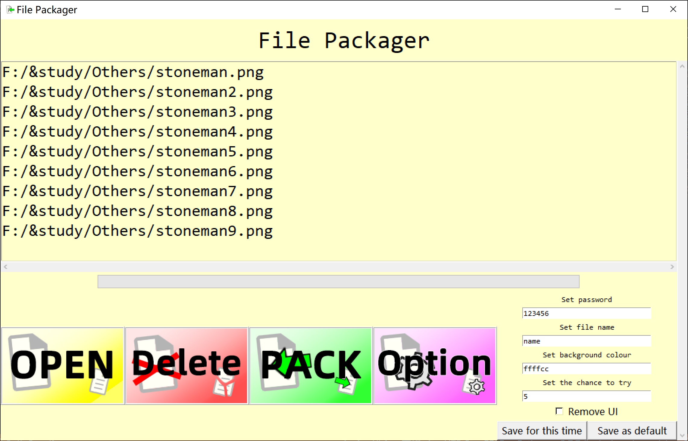

# Filepacker使用指南

### (1).打包方法：

  1.运行 *file_packer.py* ,界面如下图所示，建议 **不要** 全屏使用

 	 

  2.点击 OPEN 打开文件，支持多选但不支持重复选择同名文件 *（保留最晚选择的那个）*

 	 

  3.点击进行选择文件，按住shift多选文件

 	 

  4.点击 Delete 删除选中的文件

 	 

  5.点击 PACK 开始打包对应文件，打包时间会有进度条显示文件的读取状态，在最后一段进度条会执行打包命令，窗口会无响应一段时间，请耐心等待。

 	 

  6.点击 Option 打开设置，可对包名，密码，打包器背景颜色，密码可尝试次数，是否去除UI进行选择。（密码为空时打包结果会跳过输入密码部分，直接解压）

 	 

  7.以包名为名称的 *.exe* 文件会生成在 *dist* 文件夹下

### (2).解包方法：

  1.运行打包生成的exe文件 ，界面如下图所示，建议 **不要** 全屏使用

 	 

  2.输入密码后即可解包，会有进度条提示 *（解包速度远快于打包）*

 	 

  3.如果输入错误密码则会提示 **Wrong**

 	 

  4.在离限制次数 **3** 次的时候会进行提示，超过限制次数，文件会自毁

 	 

### (3).开发者须知：

  1.由于本人tinker水平不高，窗口全屏后模块有部分错位，建议不要全屏使用 *（帮我改好也好）*

  2.这里用的python打包的exe，不知道逆向起来是否容易破解*（我这水平是逆向不了）*

  3.生成的配置文件 *.set* 是一个存储了python字典的文件

  4.这里自毁的原理是写一个bat文件，杀死自己的进程之后自己删除自己

  5.这里有重启程序可尝试次数会恢复问题，但是我没有办法存储尝试次数 *（写文件保存有被篡改的风险）*

  6.运行时会在 *building* 文件夹下产生一些临时文件，可以在打包完后删除

  7.解包的所有文件目前仅能平铺与目录中，在后续版本中会加入写入相对路径的功能

  8.文字颜色会随背景颜色深浅改变（黑白转换）

  9.如果你直接修改配置文件，把‘fg’项的值改为True，文字颜色会变为背景色的反色。

  10.没有配置文件程序会自动生成，但不要存放错误的配置文件，会导致报错